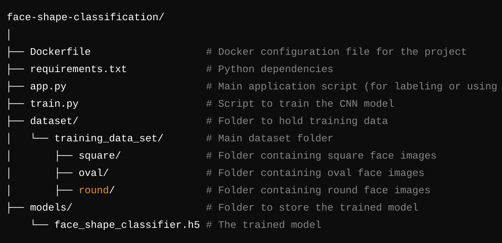

# Intention of This repo is to build a docker based Machine Learning Model Building python library to build and use the model

# Folder structure should be something like this

  

Step 1: copy the repository and download the dataset from following Google Drive:
<a href="https://drive.google.com/file/d/18PunzzS9meIqJ1ck3is7HAt-SZBfk_qQ/view?usp=sharing" target="_blank"> Download Dataset</a>

Step 2: Extract in the root folder of this project.